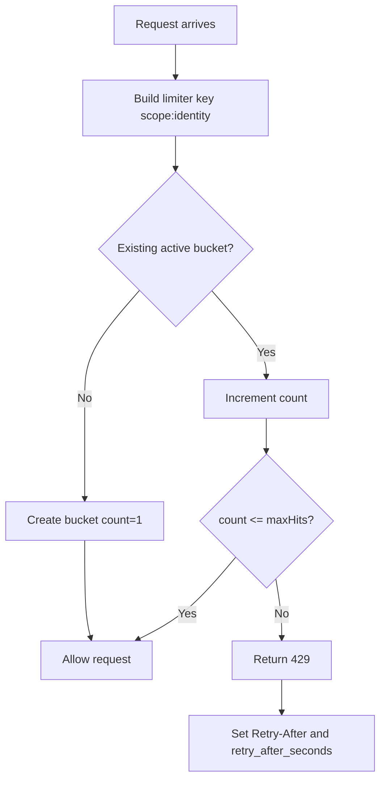

# WC Event Registration Platform

Scalable event registration platform using React + Supabase.

## Stack Overview

Frontend:

- React 19 + TypeScript + Vite
- React Router for route composition
- React Query for server state
- React Hook Form + Zod for form and runtime validation
- Tailwind CSS + Radix primitives + shadcn-style UI composition

Backend and API:

- Supabase Postgres
- Supabase Edge Functions (Deno + TypeScript)
- Supabase Auth for admin identity verification
- Function-level CORS allowlist and request hardening in shared security helpers

Database and Security:

- SQL migrations managed under supabase/migrations
- RLS-oriented schema posture with explicit grants
- Public registration write path through Edge Functions
- Shared fixed-window in-memory rate limiting for edge endpoints

Tooling and Quality:

- ESLint for linting
- Vitest for tests
- Vite production build checks
- Local Supabase CLI workflow for reproducible local development

## Product Rules

- Registration flow is ID-first (member lookup before submission)
- Admin operations require authenticated admin identity
- Public registration writes go through approved backend paths

## Coding Standards For Copilot

Project-level AI coding standards live in [.github/copilot-instructions.md](.github/copilot-instructions.md).

Use that file as the default source of truth for:

- React and TypeScript scalability standards
- Data boundary validation and form conventions
- Query, state, and error-handling patterns
- Repository architecture and verification expectations

## Route Skeleton

Public:

- /
- /events/:slug/register

Admin:

- /admin/login
- /admin/events
- /admin/events/new
- /admin/events/:id
- /admin/events/:id/fields
- /admin/events/:id/registrations

## Setup

1. Install dependencies

   npm install

2. Create environment file

   cp .env.example .env.local

3. Fill environment variables in .env.local

4. Start dev server

   npm run dev

5. Build for production

   npm run build

## Environment Variables

See .env.example.

Required values:

- VITE_SUPABASE_URL
- VITE_SUPABASE_ANON_KEY

Edge Function required values:

- ALLOWED_ORIGINS
- SUPABASE_ENV

ALLOWED_ORIGINS rules:

- Must be an explicit comma-separated allowlist of full origins.
- Only http and https origins are accepted.
- Invalid entries are ignored and logged.
- If the resolved allowlist is empty, Edge Functions fail closed and deny cross-origin requests.

SUPABASE_ENV rules:

- Use local, staging, or production.
- In production, localhost, 127.0.0.1, and ::1 are rejected from ALLOWED_ORIGINS.

Examples:

- Local:

  ```text
  ALLOWED_ORIGINS=http://localhost:5173
  SUPABASE_ENV=local
  ```

- Staging:

  ```text
  ALLOWED_ORIGINS=https://staging.example.com
  SUPABASE_ENV=staging
  ```

- Production:

  ```text
  ALLOWED_ORIGINS=https://app.example.com,https://admin.example.com
  SUPABASE_ENV=production
  ```

## Local Supabase Workflow

Run the platform fully locally before any deployment.

1. Start Docker Desktop.
2. Start the local Supabase stack.

   npm run supabase:start

3. Inspect local credentials and service URLs.

   npm run supabase:status

4. Copy the local Project URL and Publishable key into .env.local.

   ```text
   VITE_SUPABASE_URL=http://127.0.0.1:54321
   VITE_SUPABASE_ANON_KEY=your-local-publishable-key-from-supabase-status
   ```

   Configure local Edge Function origin settings in your function environment.

   ```text
   ALLOWED_ORIGINS=http://localhost:5173
   SUPABASE_ENV=local
   ```

5. Apply all migrations from scratch.

   npm run supabase:db:reset

6. If you want to load your private local member dataset, generate the ignored seed file first.

   npm run seed:members:generate

7. Re-run the database reset so the local member seed is applied.

   npm run supabase:db:reset

8. Stop the local stack when done.

   npm run supabase:stop

To create a new migration:

npm run supabase:migration:new -- migration_name_here

Only link and push to a hosted Supabase project after local validation succeeds.

## Private Local Seed Workflow

The repository supports a repeatable local-only member seed without committing member data.

- Keep your source CSV in the ignored members_info.csv file.
- Generate the ignored SQL seed with npm run seed:members:generate.
- The generated file is written to supabase/seeds/members.local.sql and is ignored by Git.
- Running npm run supabase:db:reset will apply that local seed after migrations.

This lets you reset local development data repeatedly while keeping member records out of source control.

Local admin account seed (for admin route testing):

- Email: `local@admin.com`
- Password: `Supabase@123`
- Seed source: supabase/seeds/dev.local.sql (local development only, git-ignored)

## Edge Function Rate Limiting

Edge functions use a shared in-memory fixed-window limiter in supabase/functions/\_shared/security.ts.

How it works:

- Requests are grouped by a limiter key with this shape: scope:identity.
- A bucket stores count and window start time.
- If no active bucket exists, a new bucket starts with count = 1.
- If a bucket exists, count increments.
- When count exceeds maxHits in the current window, the request is denied.
- Denied requests return HTTP 429 with Retry-After and retry_after_seconds.

Identity source:

- Public endpoints use request identity from headers in this order:
  - x-forwarded-for (first IP)
  - x-real-ip
  - cf-connecting-ip
  - fallback: origin
- Admin endpoints use verified authenticated user id from Supabase Auth.

Current limits:

- member-lookup: 60 requests per 60 seconds per source identity
- submit-registration: 20 requests per 60 seconds per source identity
- export-registrations-csv: 5 requests per 60 seconds per admin user id
- cancel-registration: 30 requests per 60 seconds per admin user id
- reactivate-registration: 30 requests per 60 seconds per admin user id

Flow overview:



Important caveat:

- This limiter is in-memory per function instance, so it is not a globally shared distributed limit.
- Counters reset on cold start, restart, or deploy.
- For strict global enforcement, use a shared backing store (for example Redis/Upstash or a database-backed limiter).

## Edge Function CORS Allowlist

Edge Functions use an explicit CORS allowlist from ALLOWED_ORIGINS in the shared helper at supabase/functions/\_shared/security.ts.

Behavior:

- Requests from listed origins receive their own origin in Access-Control-Allow-Origin.
- Requests from unlisted origins receive an obscured deny response.
- If ALLOWED_ORIGINS is unset or resolves to no valid origins, functions fail closed instead of falling back to localhost.
- If SUPABASE_ENV=production and ALLOWED_ORIGINS contains localhost-style origins, functions treat the configuration as invalid and deny requests.

Operational rule:

- Never include localhost, 127.0.0.1, or ::1 in production ALLOWED_ORIGINS.

## Database Scope

Implemented through Supabase migrations:

- core tables: users, admins, events, event_fields, registrations, registration_answers
- event invariants and indexes for duplicate registration control
- users_import_staging and import_errors tables
- process_members_import_batch function for fail-fast member imports

Current members CSV contract comes from members_info.csv:

- RFID maps to users.member_id
- Surname and Firstname are required
- full_name is derived from Firstname + Surname
- Nickname is stored in users.nickname
- Role, Category, SR_PWD, IsOIC, and Sunday availability are stored in users.metadata
