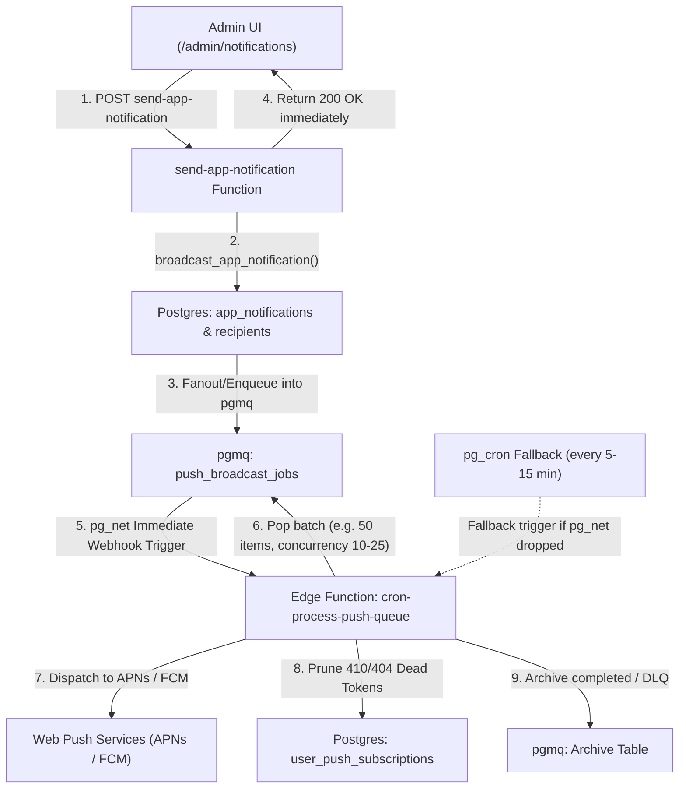

# Push Notification Scalability Analysis & Queued Architecture Roadmap

This document outlines the performance characteristics, bottlenecks, multi-phase roadmap, and repository pattern alignment for scaling **In-App Broadcast Notifications & Web Push Delivery** in Welcome Hub.

---

## 1. Executive Summary & Progress Status

- **Current State**: Phase 0.5 (Hybrid Phase 0 with Token Garbage Collection implemented in [`pushService.ts`](../../supabase/functions/send-app-notification/services/pushService.ts)).
- **Current Throughput**: Highly effective for **up to ~1,000 users** (~500ms–1.5s total round-trip).
- **Target Architecture**: Asynchronous background job queue leveraging **`pgmq`**, **`pg_net`**, and **`pg_cron`** (aligning with the repository's existing [`cron-process-push-reminders`](../../supabase/functions/cron-process-push-reminders/handler.ts) and [`cron-process-email-queue`](../../supabase/functions/cron-process-email-queue/handler.ts) queue architecture).

### Implementation Checklist

| Phase         | Milestone                             |      Status      | Details                                                                                                                                                                                                                    |
| :------------ | :------------------------------------ | :--------------: | :------------------------------------------------------------------------------------------------------------------------------------------------------------------------------------------------------------------------- |
| **Phase 1.1** | **Unified Database Query / RPC**      |    🔴 Pending    | Replace 3 PostgREST queries with 1 consolidated SQL RPC to fetch subscriptions and unread badge counts in Postgres.                                                                                                        |
| **Phase 1.2** | **Stale Token Garbage Collection**    | 🟢 **Completed** | Auto-deletes HTTP `410 Gone` and `404 Not Found` endpoints via [`_shared/push.ts`](../../supabase/functions/_shared/push.ts) & [`pushService.ts`](../../supabase/functions/send-app-notification/services/pushService.ts). |
| **Phase 1.3** | **Batch Concurrency Throttling**      |    🔴 Pending    | Bound outbound push promises to batches of 10–25 (matching Edge Function socket limits).                                                                                                                                   |
| **Phase 2.1** | **`pgmq` Queue & RPC Setup**          |    ⚪ Planned    | Create `push_notification_jobs` queue and `enqueue_broadcast_push` / `pop_broadcast_push` RPCs.                                                                                                                            |
| **Phase 2.2** | **Decoupled Admin Dispatch (<100ms)** |    ⚪ Planned    | Update `send-app-notification` to return immediately once rows are inserted & enqueued.                                                                                                                                    |
| **Phase 2.3** | **Worker Edge Function & Triggers**   |    ⚪ Planned    | Dedicated worker Edge Function triggered by `pg_net` on insert with `pg_cron` sweeper fallback.                                                                                                                            |

---

## 2. Current Architecture & Bottleneck Analysis

```
┌─────────────────┐       ┌──────────────────────────────┐       ┌───────────────────────────────┐
│ Admin Dashboard │ ────► │ Edge Function:               │ ────► │ 1. broadcast_app_notification │
│ (/admin/notif)  │       │ send-app-notification        │       │    (Inserts 400 recipients)   │
└─────────────────┘       └──────────────────────────────┘       └───────────────────────────────┘
                                         │                                       │
                                         │ 2. Fetch recipients (PostgREST)       │ Realtime Event
                                         │ 3. Fetch push subscriptions           ▼
                                         │ 4. Fetch unread counts        ┌───────────────────────────────┐
                                         │ 5. webpush.sendNotification() │ Active Browser Tabs (Clients) │
                                         ▼                               └───────────────────────────────┘
                               ┌───────────────────┐
                               │ Apple APNs / FCM  │
                               └───────────────────┘
```

### Identified Scaling Ceilings

| Scale             | Component                | Potential Failure Mode / Bottleneck                                                                                                                  |
| :---------------- | :----------------------- | :--------------------------------------------------------------------------------------------------------------------------------------------------- |
| **> 1,000 users** | PostgREST Client Query   | Default `max-rows = 1000` cap truncates recipient list when fetching `app_notification_recipients`.                                                  |
| **> 2,000 users** | Supabase Filter Query    | `.in('user_id', userIds)` creates a massive URL query string resulting in `414 URI Too Long`.                                                        |
| **> 2,500 users** | Edge Function Runtime    | Firing thousands of outbound HTTPS connections concurrently exhausts sockets and exceeds the 60s Edge Function timeout.                              |
| **All Scales**    | Stale Token Accumulation | Inactive/uninstalled device endpoints accumulate over time if HTTP `410 Gone` / `404 Not Found` responses are not pruned. _(Resolved via Phase 1.2)_ |

---

## 3. Existing Codebase Equivalents & Alignment

The repository already employs a robust `pgmq` background processing pattern for other notification pipelines:

1. **Sunday Push Reminders ([`cron-process-push-reminders`](../../supabase/functions/cron-process-push-reminders/handler.ts))**:
   - Backed by the `push_reminders` queue created in [`20260929051320_create_push_reminder_rpcs.sql`](../../supabase/migrations/20260929051320_create_push_reminder_rpcs.sql).
   - Utilizes `enqueue_push_reminder`, `pop_push_reminders`, and `archive_push_reminder`.
   - Uses batching with `PUSH_QUEUE_BATCH_SIZE = 50` and `PUSH_MESSAGE_CONCURRENCY = 5`.
2. **Email Notification Queue ([`cron-process-email-queue`](../../supabase/functions/cron-process-email-queue/handler.ts))**:
   - Backed by `pop_email_notifications` and `archive_email_notification`.
   - Dispatches via Resend with retry limits (`MAX_EMAIL_DELIVERY_ATTEMPTS = 5`) before dead-letter archiving.
3. **Local Development Safety Harness**:
   - Push and email dispatches in non-production environments are automatically captured in `local-broadcasts.log` via [`_shared/push.ts`](../../supabase/functions/_shared/push.ts) and [`_shared/resend.ts`](../../supabase/functions/_shared/resend.ts).

---

## 4. Multi-Phase Scaling Roadmap

### Phase 1: Near-Term Direct Optimizations (Up to ~5,000 Users)

Before implementing queue workers, these optimizations streamline the synchronous path:

1. **Unified Database RPC for Subscribed Recipients & Unread Counts** _(Pending)_:
   Eliminate round-trip in-memory aggregation by querying subscriptions and unread counts directly in Postgres:

   ```sql
   create or replace function public.get_subscribed_notification_recipients(
     p_notification_id uuid
   )
   returns table (
     subscription_id uuid,
     user_id uuid,
     endpoint text,
     auth_key text,
     p256dh_key text,
     unread_count bigint
   )
   language sql
   security definer
   set search_path = public
   as $$
     select
       s.id as subscription_id,
       s.user_id,
       s.endpoint,
       s.auth_key,
       s.p256dh_key,
       count(r.id) as unread_count
     from public.user_push_subscriptions s
     join public.app_notification_recipients r on r.user_id = s.user_id
     where r.is_read = false
       and s.user_id in (
         select user_id
         from public.app_notification_recipients
         where notification_id = p_notification_id
       )
     group by s.id, s.user_id, s.endpoint, s.auth_key, s.p256dh_key;
   $$;
   ```

2. **Automatic Subscription Garbage Collection** _(🟢 Completed)_:
   When `webpush.sendNotification()` throws HTTP status `410` (Gone) or `404` (Not Found), immediately delete the stale record from `user_push_subscriptions` in [`pushService.ts`](../../supabase/functions/send-app-notification/services/pushService.ts).

3. **Concurrency Throttling / Batch Chunking** _(Pending)_:
   Chunk outbound push promises in batches of 10–25 using a concurrency iterator rather than an unconstrained `Promise.allSettled()` across all recipients.

---

### Phase 2: Asynchronous Queued Architecture (5,000+ to 100,000+ Users)

Aligns with the background queue pattern established in [`.agent/skills/background-jobs/skill.md`](../../.agent/skills/background-jobs/skill.md).



#### Key Architecture Specifications:

1. **Queue Granularity & Fanout**:
   - In Postgres, `broadcast_app_notification` inserts records into `app_notification_recipients` and enqueues individual recipient payloads into the `push_broadcast_jobs` `pgmq` queue.
2. **Immediate vs Fallback Triggering**:
   - **Primary Trigger**: Database webhook or `pg_net.http_post` triggers the worker Edge Function immediately upon broadcast creation (< 200ms latency).
   - **Fallback Sweeper**: `pg_cron` invokes the worker every 5–15 minutes to guarantee eventual consistency and retry transient network failures.
3. **Worker Processing Pattern**:
   - Worker pops batches (`batch_size = 50`), processes with concurrency 10–25, deletes dead endpoints on `410`/`404`, and archives processed messages up to `MAX_PUSH_DELIVERY_ATTEMPTS = 5`.

---

## 5. Comparison Summary

| Metric                         | Phase 0 (Baseline)   | Phase 0.5 (Current)  | Phase 1 (Optimized Sync)       | Phase 2 (Queued with `pgmq` & `pg_net`) |
| :----------------------------- | :------------------- | :------------------- | :----------------------------- | :-------------------------------------- |
| **Max Practical User Base**    | ~1,000 users         | ~1,000 users         | ~5,000 users                   | **100,000+ users**                      |
| **Admin UI Wait Time**         | 500ms – 2.5s         | 500ms – 2.5s         | 300ms – 1s                     | **< 100ms (Instant)**                   |
| **Database Round-Trips**       | 3 PostgREST queries  | 3 PostgREST queries  | 1 joined SQL RPC               | 1 RPC insert + background worker        |
| **Token Garbage Collection**   | ❌ None (Stale leak) | 🟢 Pruning 410/404   | 🟢 Pruning 410/404             | 🟢 Pruning 410/404                      |
| **Fault Isolation**            | `Promise.allSettled` | `Promise.allSettled` | `Promise.allSettled` (chunked) | Full DLQ + Automatic retries            |
| **Edge Function Timeout Risk** | Low (<1k users)      | Low (<1k users)      | Medium (>3k users)             | **Zero (Decoupled background batches)** |
