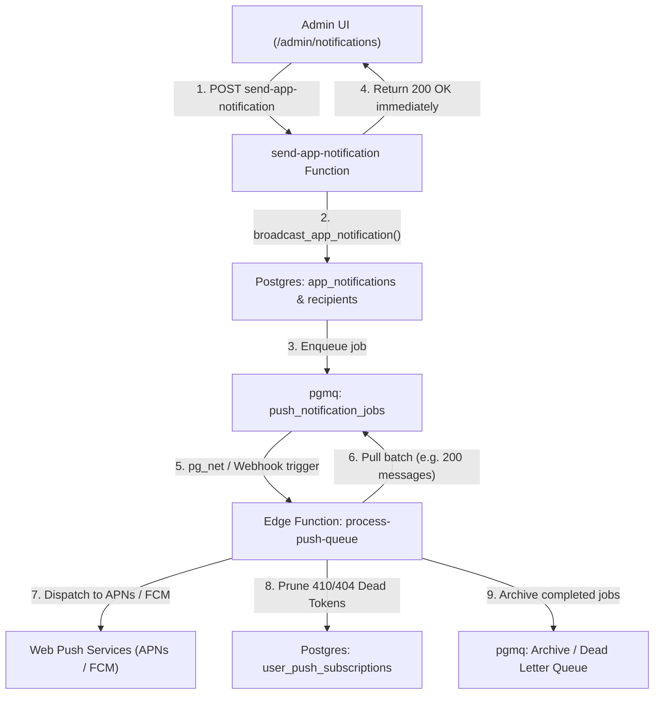

# Push Notification Scalability Analysis & Queued Architecture Roadmap

This document outlines the performance characteristics, bottlenecks, and multi-phase roadmap for scaling **In-App Broadcast Notifications & Web Push Delivery** in Welcome Hub.

---

## 1. Executive Summary

- **Current State**: Synchronous execution inside the [`send-app-notification`](../../supabase/functions/send-app-notification/index.ts) Supabase Edge Function.
- **Current Throughput**: Highly effective for **up to ~1,000 users** (~500ms–1.5s total round-trip).
- **Target Architecture**: Asynchronous background job queue leveraging **`pgmq`** and **`pg_net`** (aligning with the repository's email background queue architecture).

---

## 2. Current Architecture & Bottleneck Analysis

```
┌─────────────────┐       ┌──────────────────────────────┐       ┌───────────────────────────────┐
│ Admin Dashboard │ ────► │ Edge Function:               │ ────► │ 1. broadcast_app_notification │
│ (/admin/notif)  │       │ send-app-notification        │       │    (Inserts 400 recipients)   │
└─────────────────┘       └──────────────────────────────┘       └───────────────────────────────┘
                                         │                                       │
                                         │ 2. Fetch recipients (PostgREST)       │ Realtime Event
                                         │ 3. Fetch push subscriptions           ▼
                                         │ 4. Fetch unread counts        ┌───────────────────────────────┐
                                         │ 5. webpush.sendNotification() │ Active Browser Tabs (Clients) │
                                         ▼                               └───────────────────────────────┘
                               ┌───────────────────┐
                               │ Apple APNs / FCM  │
                               └───────────────────┘
```

### Identified Scaling Ceilings

| Scale             | Component                | Potential Failure Mode / Bottleneck                                                                                       |
| :---------------- | :----------------------- | :------------------------------------------------------------------------------------------------------------------------ |
| **> 1,000 users** | PostgREST Client Query   | Default `max-rows = 1000` cap truncates recipient list when fetching `app_notification_recipients`.                       |
| **> 2,000 users** | Supabase Filter Query    | `.in('user_id', userIds)` creates a massive URL query string resulting in `414 URI Too Long`.                             |
| **> 2,500 users** | Edge Function Runtime    | Firing thousands of outbound HTTPS connections concurrently exhausts sockets and exceeds the 60s Edge Function timeout.   |
| **All Scales**    | Stale Token Accumulation | Inactive/uninstalled device endpoints accumulate over time if HTTP `410 Gone` / `404 Not Found` responses are not pruned. |

---

## 3. Multi-Phase Scaling Roadmap

### Phase 1: Near-Term Direct Optimizations (Up to ~5,000 Users)

Before implementing full queue infrastructure, these optimizations streamline the synchronous path:

1. **Unified Database RPC / SQL View for Subscribed Recipients**:
   Eliminate round-trip in-memory aggregation by querying subscriptions and unread counts directly in Postgres:

   ```sql
   select
     s.id as subscription_id,
     s.user_id,
     s.endpoint,
     s.auth_key,
     s.p256dh_key,
     count(r.id) as unread_count
   from
     public.user_push_subscriptions s
     join public.app_notification_recipients r on r.user_id = s.user_id
   where
     r.is_read = false
     and s.user_id in (
       select
         user_id
       from
         public.app_notification_recipients
       where
         notification_id = p_notification_id
     )
   group by
     s.id,
     s.user_id,
     s.endpoint,
     s.auth_key,
     s.p256dh_key;
   ```

2. **Automatic Subscription Garbage Collection**:
   When `webpush.sendNotification()` throws an error with HTTP status `410` (Gone) or `404` (Not Found), immediately delete the stale record from `user_push_subscriptions`:

   ```ts
   if (err?.statusCode === 410 || err?.statusCode === 404) {
     await supabase.from('user_push_subscriptions').delete().eq('endpoint', sub.endpoint);
   }
   ```

3. **Concurrency Throttling / Batch Chunking**:
   Chunk outbound push promises in batches of 50–100 instead of `Promise.allSettled()` across the entire list to prevent socket starvation.

---

### Phase 2: Asynchronous Queued Architecture (5,000+ to 100,000+ Users)

Aligns with the background queue pattern established in [`.agent/skills/background-jobs/SKILL.md`](../../.agent/skills/background-jobs/SKILL.md) (mirroring the transactional email queue).



#### Key Components:

1. **Queue Definition (`pgmq`)**:

   ```sql
   select
     pgmq.create ('push_notification_jobs');
   ```

2. **Decoupled Admin Experience**:
   - The admin UI calls `broadcast_app_notification`, which inserts database records and enqueues the job into `push_notification_jobs`.
   - The HTTP response returns in **< 100ms** with `{ success: true, queued: true }`.

3. **Worker Edge Function (`process-push-queue`)**:
   - Triggered via `pg_net` on insert, with a fallback `pg_cron` sweeper every 5–15 minutes.
   - Reads batches of messages using `pgmq.read('push_notification_jobs', vt => 60, qty => 100)`.
   - Dispatches pushes with concurrency controls.
   - Deletes expired subscriptions on `410`/`404`.
   - Archives completed jobs or sends unresolvable failures to the Dead Letter Queue (DLQ).

---

## 4. Comparison Summary

| Metric                         | Phase 0 (Current)            | Phase 1 (Optimized Sync)      | Phase 2 (Queued with `pgmq`)     |
| :----------------------------- | :--------------------------- | :---------------------------- | :------------------------------- |
| **Max Practical User Base**    | ~1,000 users                 | ~5,000 users                  | 100,000+ users                   |
| **Admin UI Wait Time**         | 500ms – 2.5s                 | 300ms – 1s                    | **< 100ms (Instant)**            |
| **Database Round-Trips**       | 3 queries                    | 1 joined query                | 1 RPC insert + background worker |
| **Fault Isolation**            | Promise-level (`allSettled`) | Promise-level + Token pruning | Full DLQ + Automatic retries     |
| **Edge Function Timeout Risk** | Low (at <1k)                 | Medium (at >3k)               | **None (Decoupled chunks)**      |
