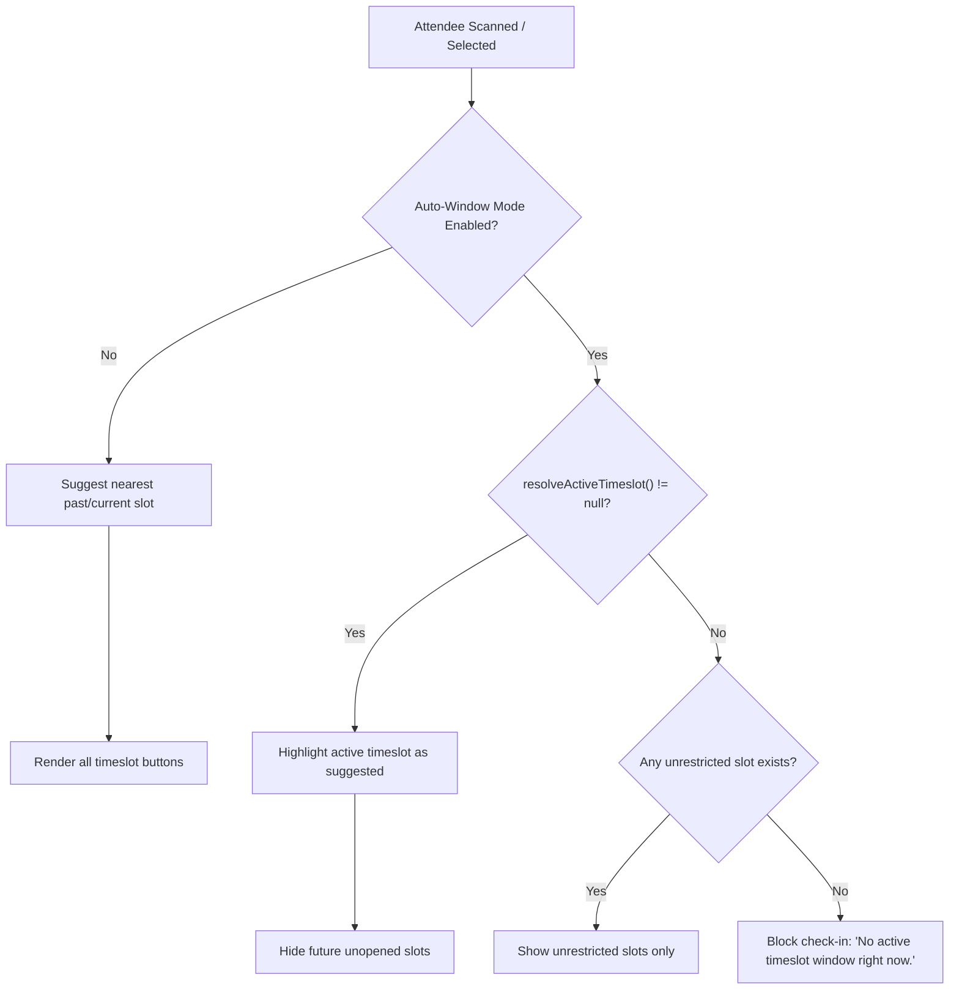
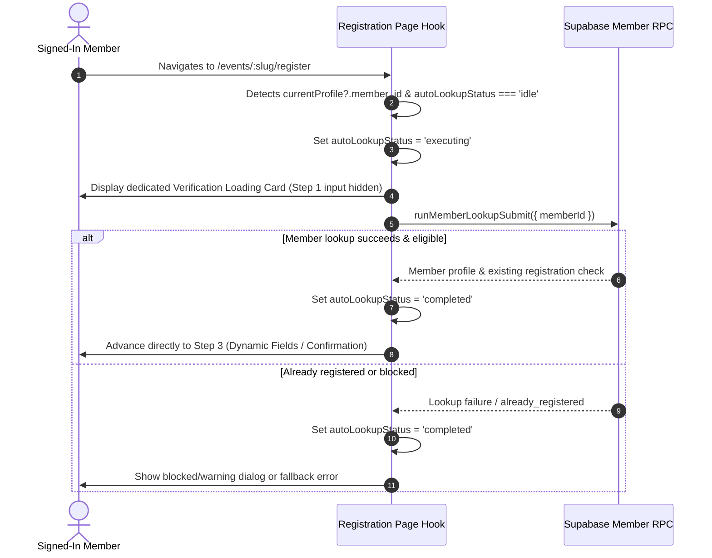

# Automated Resolution Mechanisms Guide

This guide details the three automated resolution ("auto resolver") mechanisms implemented in the repository:

1. **Attendance Timeslot Active-Window Resolver** (Event Check-In)
2. **Service Commitment Date Resolver** (Sunday Volunteer Service Matrix)
3. **Member Registration Auto-Lookup / Resolver** (Event & Form Registration)

---

## At-a-Glance Comparison

| Resolver                     | Domain              | Primary Purpose                                                                 | Trigger / Evaluation                                                  | Fallback Behavior                                                                                    |
| :--------------------------- | :------------------ | :------------------------------------------------------------------------------ | :-------------------------------------------------------------------- | :--------------------------------------------------------------------------------------------------- |
| **Timeslot Active-Window**   | Attendance Check-In | Auto-detects and suggests/restricts the active check-in slot                    | Current clock time (`nowMs`) evaluated against slot window boundaries | Suggests nearest past or first future slot (if manual mode) or blocks check-in (if auto-window mode) |
| **Commitment Date Resolver** | Service Attendance  | Reconstructs member Sunday commitment rules as of a historical date             | Sunday target date evaluated against snapshot `effective_date`        | Falls back to current `users.metadata`                                                               |
| **Registration Auto-Lookup** | Member Registration | Skips Step 1 ID input for signed-in members and advances to confirmation/fields | On mount when active member session credentials exist                 | Renders Step 1 manual lookup form                                                                    |

---

## 1. Attendance Timeslot Active-Window Resolver

### Overview

In multi-timeslot events (e.g., conferences, batch orientations, repeated workshops), organizers can define check-in windows per timeslot (e.g., opens 60 minutes before, closes 30 minutes after the slot). The active-window resolver computes whether an event is running in **auto-window mode**, identifies which slot is currently open, and enforces check-in restrictions in the admin check-in console.

### Key Code References

- **Domain Transforms & Selectors**: [`src/lib/domain/attendance/transforms.ts`](file:///Users/baronpatrickparedes/Projects/wc-event-registration/src/lib/domain/attendance/transforms.ts#L143-L170)
- **Suggested Slot Calculation**: [`src/pages/admin/events/[id]/attendance/check-in/utils/timeslotCalculations.ts`](file:///Users/baronpatrickparedes/Projects/wc-event-registration/src/pages/admin/events/[id]/attendance/check-in/utils/timeslotCalculations.ts#L12-L42)
- **Check-In Submission Guard**: [`src/pages/admin/events/[id]/attendance/check-in/hooks/useCheckInSubmission.ts`](file:///Users/baronpatrickparedes/Projects/wc-event-registration/src/pages/admin/events/[id]/attendance/check-in/hooks/useCheckInSubmission.ts#L49-L88)
- **UI Selection Panel**: [`src/pages/admin/events/[id]/attendance/check-in/components/AttendeeTimeslotSelectionPanel.tsx`](file:///Users/baronpatrickparedes/Projects/wc-event-registration/src/pages/admin/events/[id]/attendance/check-in/components/AttendeeTimeslotSelectionPanel.tsx#L52-L69)

### Data Contract

Timeslots are stored as structured JSON in `attendance_settings.timeslots`:

```typescript
export type AttendanceTimeslotConfig = {
  slot_at: string; // ISO UTC timestamp for the session
  opens_at: string | null; // ISO UTC timestamp when check-in opens
  closes_at: string | null; // ISO UTC timestamp when check-in closes
};
```

### Resolution Logic

#### 1. Auto-Window Mode Detection

Auto-window mode is **derived** rather than a separate database toggle:

```typescript
export function isAutoWindowModeEnabled(
  settings: Pick<AttendanceSettings, 'timeslot_enabled' | 'timeslots'>,
): boolean {
  if (!settings.timeslot_enabled) return false;
  return normalizeAttendanceTimeslots(settings.timeslots).some(
    (slot) => slot.opens_at !== null && slot.closes_at !== null,
  );
}
```

#### 2. Active Timeslot Resolution (`resolveActiveTimeslot`)

Evaluates the current system time against all configured slot windows:

```typescript
export function resolveActiveTimeslot(
  nowIso: string,
  timeslots: AttendanceTimeslotConfig[],
): AttendanceTimeslotConfig | null {
  const nowMs = Date.parse(nowIso);
  if (!Number.isFinite(nowMs)) return null;

  return (
    normalizeAttendanceTimeslots(timeslots).find((slot) => {
      if (!slot.opens_at || !slot.closes_at) return false;
      const opensAtMs = Date.parse(slot.opens_at);
      const closesAtMs = Date.parse(slot.closes_at);
      return nowMs >= opensAtMs && nowMs <= closesAtMs;
    }) ?? null
  );
}
```

#### 3. Suggested Slot Resolution (`resolveSuggestedTimeslot`)

- When **auto-window mode** is active: Preselects the `activeTimeslot.slot_at` (if present).
- When **manual timeslot mode** is active (no windows specified):
  - Finds the latest past/current slot relative to `nowMs`.
  - If all slots are in the future, defaults to the earliest upcoming slot.

### Admin Check-In UX Workflow



---

## 2. Service Commitment Date Resolver (`resolveMetadataForDate`)

### Overview

In the Sunday volunteer service module, members register specific recurring commitments (e.g., attending 9AM service on the 1st and 3rd Sundays of every month) in `users.metadata`. When commitments change over time, evaluating past attendance against _current_ commitments would produce false positives (e.g., marking someone as absent from a service they only recently committed to).

The system uses point-in-time snapshots in `user_commitment_history` and resolves the exact metadata active on any historical Sunday.

### Key Code References

- **Domain Resolver**: [`src/lib/domain/services/service-matrix.ts`](file:///Users/baronpatrickparedes/Projects/wc-event-registration/src/lib/domain/services/service-matrix.ts#L145-L157)
- **Matrix Calculation**: [`computeMatrixGrid` in service-matrix.ts](file:///Users/baronpatrickparedes/Projects/wc-event-registration/src/lib/domain/services/service-matrix.ts#L159-L188)
- **Database Trigger & Arch Guide**: [`docs/guides/user-commitment-history.md`](file:///Users/baronpatrickparedes/Projects/wc-event-registration/docs/guides/user-commitment-history.md)

### Resolution Algorithm

Snapshots in `user_commitment_history` are query-sorted descending by `effective_date` (which always points to the nearest upcoming Sunday when modified).

```typescript
export function resolveMetadataForDate(
  targetDate: string,
  currentMetadata: Record<string, string> | null | undefined,
  snapshots: UserCommitmentSnapshot[],
): Record<string, string> | null | undefined {
  // snapshots are sorted by effective_date DESC
  const applicableSnapshot = snapshots.find((s) => s.effective_date <= targetDate);
  if (applicableSnapshot) {
    return applicableSnapshot.metadata as Record<string, string>;
  }
  // Fallback: If targetDate precedes any recorded snapshot, fall back to current metadata
  return currentMetadata;
}
```

### Integration with Service Matrix

When rendering `ServiceAttendanceHistoryTab`:

1. For each Sunday in the active month, `resolveMetadataForDate(sunday.dateStr, currentMetadata, snapshots)` extracts the commitment object for that specific Sunday.
2. The Sunday ordinal (e.g., `first_sunday`, `third_sunday`) is extracted.
3. The member's recorded attendance or absence is compared against the resolved commitment for that day.

---

## 3. Member Registration Auto-Lookup / Resolver

### Overview

When a signed-in member visits an event registration page (`/events/:slug/register`) or public form (`/forms/:slug/submit`), the application automatically detects their authenticated session, performs an auto-lookup by `member_id`, and advances past Step 1.

### Key Code References

- **Page State Hook**: [`src/pages/events/[slug]/register/hooks/useEventRegistrationPageState.ts`](file:///Users/baronpatrickparedes/Projects/wc-event-registration/src/pages/events/[slug]/register/hooks/useEventRegistrationPageState.ts#L300-L340)
- **Form State Hook**: [`src/pages/forms/[slug]/submit/hooks/useFormSubmissionPageState.ts`](file:///Users/baronpatrickparedes/Projects/wc-event-registration/src/pages/forms/[slug]/submit/hooks/useFormSubmissionPageState.ts#L130-L165)
- **Auto-Lookup Loading Card**: Rendered during the `executing` status to avoid flickering the Step 1 input form.

### Execution Flow



### Invariants & Guardrails

- **No Form Flickering**: `autoLookupStatus` defaults to `'idle'` and switches to `'executing'` before any render pass can display the manual member ID search box.
- **Kiosk Timeout Guard**: Kiosk automatic reset timers are disabled during signed-in member sessions so that personal form entries are not wiped prematurely.
- **Confirmation Required**: For events without dynamic fields, auto-resolved members are still presented with an explicit confirmation step before registering.

---

## 4. Verification and Testing

Each resolver is backed by unit tests verifying boundaries, null values, and edge conditions:

| Mechanism                    | Test Files                                                                                                                                                                                                                                                                                                                                                                                                                                             | Run Command                                                                                                                                                            |
| :--------------------------- | :----------------------------------------------------------------------------------------------------------------------------------------------------------------------------------------------------------------------------------------------------------------------------------------------------------------------------------------------------------------------------------------------------------------------------------------------------- | :--------------------------------------------------------------------------------------------------------------------------------------------------------------------- |
| **Timeslot Active-Window**   | [`src/lib/domain/attendance/__tests__/transforms.test.ts`](file:///Users/baronpatrickparedes/Projects/wc-event-registration/src/lib/domain/attendance/__tests__/transforms.test.ts)<br>[`src/pages/admin/events/[id]/attendance/check-in/utils/__tests__/timeslotCalculations.test.ts`](file:///Users/baronpatrickparedes/Projects/wc-event-registration/src/pages/admin/events/[id]/attendance/check-in/utils/__tests__/timeslotCalculations.test.ts) | `npx vitest run src/lib/domain/attendance/__tests__/transforms.test.ts "src/pages/admin/events/[id]/attendance/check-in/utils/__tests__/timeslotCalculations.test.ts"` |
| **Commitment Date Resolver** | [`src/lib/domain/services/__tests__/service-matrix.test.ts`](file:///Users/baronpatrickparedes/Projects/wc-event-registration/src/lib/domain/services/__tests__/service-matrix.test.ts)                                                                                                                                                                                                                                                                | `npx vitest run src/lib/domain/services/__tests__/service-matrix.test.ts`                                                                                              |
| **Registration Auto-Lookup** | [`src/pages/events/[slug]/register/__tests__/useEventRegistrationPageState.test.ts`](file:///Users/baronpatrickparedes/Projects/wc-event-registration/src/pages/events/[slug]/register/__tests__/useEventRegistrationPageState.test.ts)                                                                                                                                                                                                                | `npx vitest run "src/pages/events/[slug]/register/__tests__/useEventRegistrationPageState.test.ts"`                                                                    |
