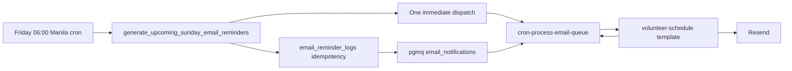

# Automated Sunday Email Reminders

This guide describes how upcoming Sunday service reminders are generated, queued, and delivered by email. For the companion push workflow, see [Automated Sunday Service Push Reminders](automated-sunday-push-reminders.md).

## Workflow

## Schedules

| Job                                               | Schedule                                      | Responsibility                                         |
| ------------------------------------------------- | --------------------------------------------- | ------------------------------------------------------ |
| `generate_upcoming_sunday_email_reminders_friday` | `0 22 * * 4` UTC, or Friday 06:00 Asia/Manila | Generate, enqueue, and trigger one immediate dispatch. |
| `process_email_queue_15m`                         | `*/15 * * * *`                                | Fallback sweep and retry for queued email messages.    |

The Friday wrapper triggers the worker once after a non-empty batch is queued. The 15-minute job remains as a recovery sweep for failures and messages not drained by the immediate run.

## Recipient And Message Generation

`public.generate_upcoming_sunday_email_reminders()` in the migration `20260930140000_create_upcoming_sunday_email_reminders.sql`:

- Finds the nearest upcoming Sunday using the `Asia/Manila` date.
- Determines the Sunday ordinal in the month and reads the matching `first_sunday` through `fifth_sunday` value from `public.users.metadata`.
- Enqueues a reminder for each user with a non-empty email address and commitment for that Sunday. Push-subscription status is not required for email.
- Formats common service-time values and records the processed Sunday in `public.email_reminder_logs`.
- Uses the unique Sunday log to prevent a second email batch for the same Sunday; subsequent calls return `0`.

The queue payload uses the `volunteer-schedule` template slug and includes `user_id`, `first_name`, `service_times`, `sunday_date`, `sunday_label`, `profile_url`, and `target_url` metadata.

## Queue Delivery

The Friday wrapper and `process_email_queue_15m` both invoke `cron-process-email-queue`. Each invocation reads pages of up to 50 messages from the `email_notifications` PGMQ queue, resolves the `volunteer-schedule` slug through `public.email_templates`, and sends messages with at most five Resend requests in flight. The worker continues reading pages until no visible messages remain.

Successfully sent messages are archived. Unknown event types and invalid messages are archived without delivery. Resend failures, template lookup failures, and processing exceptions remain queued for retry. PGMQ makes them visible again after the 30-second visibility timeout, and the next 15-minute sweep retries them. After five failed reads, the worker archives the message in PGMQ's archive table for inspection.

Delivery is at-least-once: if Resend accepts an email but the worker encounters an error before receiving or recording the success response, a later retry may send a duplicate.

The sender address is `RESEND_FROM_EMAIL`, defaulting to `noreply@welcomechurch.ph`. Delivery requires `RESEND_API_KEY`.

## Security And Operations

- The generator and queue RPCs revoke execution from `PUBLIC`, `anon`, and `authenticated`; service-role execution is granted for the internal job path.
- The immediate-dispatch wrapper calls the existing `trigger_email_processor()`, which reads `project_url` and `cron_role_key` from Supabase Vault, with database settings as fallbacks, and sends `X-Cron-Key` to the Edge Function.
- `cron-process-email-queue` is registered with `verify_jwt = false`; the shared Edge Function hook validates the cron key.
- The base Friday schedule is in `20260930140100_schedule_upcoming_sunday_email_reminders_cron.sql`; `20261001100000_dispatch_sunday_email_reminders_immediately.sql` updates it to invoke the batch-and-dispatch wrapper.
- `20261001100200_restore_reminder_queue_sweepers.sql` keeps `process_email_queue_15m` active as the fallback sweep.

## Tests

`supabase/tests/upcoming_sunday_email_reminders.test.sql` covers service-time formatting, enqueuing for an eligible user, creation of one Sunday log, and idempotency. `supabase/functions/cron-process-email-queue/__tests__/handler.test.ts` covers an empty queue, successful delivery and archival, unknown event types, and provider failures.
