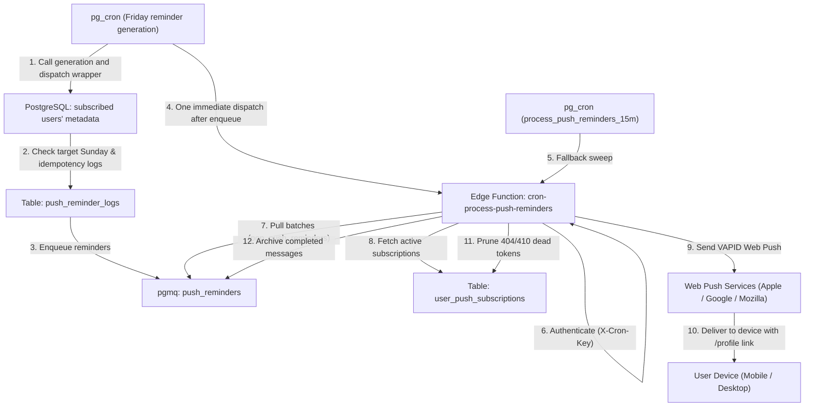

# Automated Sunday Service Push Reminders Guide

This document outlines the architecture, data flow, scheduling mechanism, security model, and idempotency guarantees for the **Automated Sunday Service Push Reminder** system.

For the companion email reminder workflow, see [Automated Sunday Email Reminders](automated-sunday-email-reminders.md).

---

## 📑 Table of Contents

1. [System Overview](#1-system-overview)
2. [Architecture & Component Diagram](#2-architecture--component-diagram)
3. [End-to-End Workflow](#3-end-to-end-workflow)
4. [Database Layer & Queue Mechanics](#4-database-layer--queue-mechanics)
   - [Sunday Ordinal & Schedule Resolution](#sunday-ordinal--schedule-resolution)
   - [Idempotency & Duplicate Protection](#idempotency--duplicate-protection)
   - [PGMQ Queue Integration](#pgmq-queue-integration)
5. [Edge Function Processing (`cron-process-push-reminders`)](#5-edge-function-processing-cron-process-push-reminders)
   - [Batch Processing Loop](#batch-processing-loop)

- [Retries And Archiving](#retries-and-archiving)
- [Web Push Payload & Deep Linking](#web-push-payload--deep-linking)
- [Stale Subscription Auto-Pruning](#stale-subscription-auto-pruning)

6. [Security & Authentication Model](#6-security--authentication-model)
   - [Dedicated `CRON_ROLE_KEY` Validation](#dedicated-cron_role_key-validation)
   - [Vault Storage](#vault-storage)
7. [Deployment & Configuration Reference](#7-deployment--configuration-reference)

---

## 1. System Overview

The Automated Sunday Service Push Reminder system automatically notifies volunteers and members of their scheduled Sunday service commitments.

### Key Characteristics:

- **Zero Manual Admin Action**: Runs on an automated schedule via `pg_cron` and Supabase Edge Functions.
- **Idempotent Generation**: The generator enqueues at most one reminder batch per upcoming Sunday date.
- **Deep Linking**: Push notifications direct users directly to [`/profile?tab=commitments`](/profile?tab=commitments) to view their schedule.
- **Decoupled Security**: Authenticated via a dedicated `CRON_ROLE_KEY` stored in Supabase Vault without exposing `SUPABASE_SERVICE_ROLE_KEY` in plain text.

---

## 2. Architecture & Component Diagram



---

## 3. End-to-End Workflow

1. **Reminder Generation**: Every Friday at 06:00 Asia/Manila (`0 22 * * 4` UTC), `pg_cron` invokes a wrapper that calls `generate_upcoming_sunday_push_reminders()` for subscribed users and triggers the Edge Function once after enqueueing.
2. **Queue Sweeping**: Every 15 minutes (`*/15 * * * *`), `pg_cron` calls `net.http_post` targeting the `cron-process-push-reminders` edge function with the header `X-Cron-Key` as a fallback and retry sweep.
3. **Authentication**: `useEdgeHook` inspects `X-Cron-Key` (or `Bearer <key>`) against the environment variable `CRON_ROLE_KEY` and authorizes the request as `callerType = 'cron'`.
4. **Resolution**:
   - Calculates the target date of the nearest upcoming Sunday in Manila Time (`Asia/Manila`, UTC+8).
   - Computes whether it is the 1st, 2nd, 3rd, 4th, or 5th Sunday of that month.
   - Maps to the user's commitment field (`first_sunday`, `second_sunday`, `third_sunday`, `fourth_sunday`, `fifth_sunday` in `users.metadata`).
5. **Idempotency Guard**: The generator inserts the upcoming Sunday into `push_reminder_logs`. If that Sunday has already been generated, it skips the batch.
6. **Queue Enqueue**: New reminders are written to the `push_reminders` queue managed by PostgreSQL Message Queue `pgmq`.
7. **Queue Processing**: The edge function reads pages of up to 50 messages from `pop_push_reminders()` with a 60-second visibility timeout. It processes at most five messages concurrently and sends each message's subscriptions sequentially, limiting push requests in flight to five.
8. **Delivery**: For each message, queries the user's active Web Push subscriptions from `user_push_subscriptions` and delivers the notification using VAPID keys.
9. **Archiving & Pruning**:

- Successfully processed messages are archived (`pgmq.archive`).
- Expired endpoints returning HTTP `404` or `410 Gone` are deleted from `user_push_subscriptions`.
- Transient delivery or subscription lookup failures remain in the queue for another sweep. After five failed reads, the message is archived for inspection.

---

## 4. Database Layer & Queue Mechanics

### Sunday Ordinal & Schedule Resolution

The helper functions calculate the exact upcoming Sunday and which ordinal week it represents:

```sql
-- 1. Identify upcoming Sunday
v_upcoming_sunday := date_trunc('week', v_now_manila + interval '1 day')::date + interval '6 days';

-- 2. Compute ordinal Sunday (1 to 5)
v_day_of_month := extract(day from v_upcoming_sunday)::int;
v_ordinal := ((v_day_of_month - 1) / 7) + 1;
```

Slot strings (e.g. `["9AM", "12NN"]` or `"9:00 AM, 12:00 NN"`) are normalized into clean human-readable text:

> _"Reminder: You are scheduled this Sunday at 9:00 AM and 12:00 NN."_

### Idempotency & Duplicate Protection

The `push_reminder_logs` table enforces one generation per upcoming Sunday date:

```sql
create table if not exists public.push_reminder_logs (
  id uuid primary key default gen_random_uuid (),
  sunday_date date not null unique,
  processed_at timestamptz not null default now ()
);
```

The generator inserts the Sunday date before walking subscribed users. A unique violation means that Sunday has already been generated, so it returns without enqueueing a duplicate batch.

### PGMQ Queue Integration

The queue is created via `pgmq.create('push_reminders')`. Two security-definer helper RPCs manage message state:

- `public.pop_push_reminders(batch_size int)`: Reads messages with a 60-second visibility timeout (`pgmq.read`).
- `public.archive_push_reminder(message_id bigint)`: Permanently archives the processed message (`pgmq.archive`).

---

## 5. Edge Function Processing (`cron-process-push-reminders`)

### Batch Processing Loop

The edge function continuously pops batches of up to 50 messages until the queue is drained:

```typescript
while (true) {
  const { data: messages, error: popError } = await client.rpc('pop_push_reminders', {
    batch_size: 50,
  });

  if (!messages || messages.length === 0) {
    break; // Queue drained
  }
  // Process batch concurrently...
}
```

### Retries And Archiving

The worker acknowledges a reminder only after successful delivery or when the message is terminal (malformed payload or no active subscription). Transient Web Push failures and subscription lookup errors are left unarchived so PGMQ makes them visible again after the 60-second visibility timeout. The immediate Friday dispatch drains the new batch; the 15-minute sweeper retries failures and recovers messages not drained by that invocation.

PGMQ's `read_ct` counts delivery attempts. After five failed reads, the worker archives the message instead of retrying indefinitely. The archived message remains available in PGMQ's archive table for inspection. If a user has multiple subscriptions and one delivery succeeds while another transiently fails, retrying the message may deliver a duplicate to the successful subscription.

### Web Push Payload & Deep Linking

Each notification payload includes the target URL pointing directly to the user's commitments tab:

```typescript
const pushPayload = JSON.stringify({
  title: 'Service Reminder',
  body: notificationMessage,
  url: payload.target_url || payload.url || '/profile?tab=commitments',
});
```

When tapped on a mobile device or browser, the Service Worker opens or focuses the app on `/profile?tab=commitments`.

### Stale Subscription Auto-Pruning

If a user uninstalled the PWA, revoked permissions, or the browser invalidated the push subscription, Web Push servers return `404 Not Found` or `410 Gone`. The edge function aggregates these IDs and batch-deletes them:

```typescript
if (err.statusCode === 404 || err.statusCode === 410) {
  subscriptionsToDelete.add(sub.id);
}
```

---

## 6. Security & Authentication Model

### Dedicated `CRON_ROLE_KEY` Validation

Rather than granting `SUPABASE_SERVICE_ROLE_KEY` to cron tasks, the system uses a dedicated, rotatable secret key `CRON_ROLE_KEY`.

In `supabase/functions/_shared/edge.ts`:

```typescript
if (options.allowCronRole || options.requireCron) {
  const cronKeyHeader = options.req.headers.get('x-cron-key')?.trim();
  const authHeader = options.req.headers.get('authorization')?.trim() ?? '';
  const bearerToken = authHeader.replace(/^Bearer\s+/i, '').trim();
  const providedKey = cronKeyHeader || bearerToken;
  const expectedCronKey = env.cronRoleKey || Deno.env.get('CRON_ROLE_KEY');

  if (expectedCronKey && providedKey && providedKey === expectedCronKey) {
    callerType = 'cron';
  }
}
```

### Vault Storage

In SQL migrations, secrets are retrieved from `vault.decrypted_secrets`:

```sql
select
  decrypted_secret into v_cron_key
from
  vault.decrypted_secrets
where
  name = 'cron_role_key'
limit
  1;
```

This prevents hardcoding API keys in migration files or database function definitions.

---

## 7. Deployment & Configuration Reference

### Secrets Checklist

| Secret Name         | Location                                | Description                                                       |
| :------------------ | :-------------------------------------- | :---------------------------------------------------------------- |
| `CRON_ROLE_KEY`     | Supabase Edge Function Secrets          | Shared secret key for authenticating cron jobs                    |
| `cron_role_key`     | Supabase Database Vault                 | Same shared secret key used by `pg_cron` jobs                     |
| `project_url`       | Supabase Database Vault                 | Base URL of the Supabase project (e.g. `https://xyz.supabase.co`) |
| `VAPID_PUBLIC_KEY`  | Edge Function Secrets & Frontend `.env` | Public VAPID key for web push subscription & signing              |
| `VAPID_PRIVATE_KEY` | Edge Function Secrets                   | Private VAPID key for signing web push payloads                   |

`20261001100100_dispatch_sunday_push_reminders_immediately.sql` installs the push dispatch wrapper and updates the Friday job. `20261001100200_restore_reminder_queue_sweepers.sql` keeps `process_push_reminders_15m` active as the fallback sweep.

### Deploy Edge Functions

```bash
# Deploy Push Reminders Cron Edge Function
supabase functions deploy cron-process-push-reminders --no-verify-jwt

# Deploy Email Queue Cron Edge Function
supabase functions deploy cron-process-email-queue --no-verify-jwt
```
