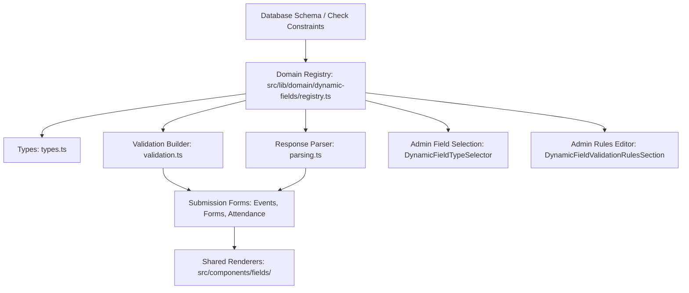

# Dynamic Field Types Architecture & Authoring Guide

This guide documents the centralized Dynamic Fields architecture in the application and provides a step-by-step procedure for adding new field types across Events, Attendance, and Forms.

---

## 1. Overview & Architecture

Dynamic fields are user-configurable inputs used across three main domains:

1. **Event Registration Fields** (`public.event_fields`)
2. **Event Attendance / Check-In Fields** (`public.attendance_fields`)
3. **Form Fields** (`public.form_fields`)

Rather than having duplicated field types, validation rules, and renderers across each domain, all dynamic fields are consolidated into a centralized system under `src/lib/domain/dynamic-fields/` and `src/components/fields/`.



---

## 2. Directory & Component Structure

| Path                                                       | Purpose                                                                                                                                                            |
| :--------------------------------------------------------- | :----------------------------------------------------------------------------------------------------------------------------------------------------------------- |
| `src/lib/domain/dynamic-fields/types.ts`                   | Base definitions (`DynamicFieldType`, `DynamicFieldLike`, `DynamicFieldDefinition`, `ValidationRules`).                                                            |
| `src/lib/domain/dynamic-fields/registry.ts`                | Central definition registry (`DYNAMIC_FIELD_DEFINITIONS`, `getFieldDefinition`, `isValidFieldType`).                                                               |
| `src/lib/domain/dynamic-fields/validation.ts`              | Dynamic Zod schema builder (`buildDynamicFieldResponseSchema`, `createFieldZodSchema`).                                                                            |
| `src/lib/domain/dynamic-fields/parsing.ts`                 | Submission parsing & default values (`parseDynamicFieldResponseValue`, `createDynamicFieldDefaultValues`).                                                         |
| `src/components/ui/DynamicFieldTypeSelector.tsx`           | Standardized category-grouped dropdown for admin field configuration modals.                                                                                       |
| `src/components/ui/DynamicFieldValidationRulesSection.tsx` | Shared validation rules editor (required, min/max length, min/max numeric/rating, options).                                                                        |
| `src/components/fields/`                                   | Modular field renderers (`TextFieldRenderer`, `RatingFieldRenderer`, `DateFieldRenderer`, `SelectFieldRenderer`, `CheckboxFieldRenderer`, `DynamicFieldRenderer`). |

---

## 3. Step-by-Step: Adding a New Field Type

Follow these 6 steps whenever you add a new field type (for example, `signature`, `file_upload`, `slider`, etc.):

### Step 1: Database Migration

If the database enforces check constraints on `field_type` in `event_fields`, `attendance_fields`, or `form_fields`, create a migration updating the constraint:

```sql
-- supabase/migrations/YYYYMMDDHHMMSS_add_<type>_field_type.sql
ALTER TABLE public.event_fields
DROP CONSTRAINT IF EXISTS event_fields_field_type_check;

ALTER TABLE public.event_fields ADD CONSTRAINT event_fields_field_type_check CHECK (
  field_type IN (
    'text',
    'textarea',
    'email',
    'phone',
    'number',
    'select',
    'radio',
    'multiselect',
    'multiselect_toggle',
    'date',
    'datetime',
    'checkbox',
    'color_picker',
    'rating',
    '<new_type>'
  )
);

-- Repeat for form_fields and attendance_fields if applicable
```

### Step 2: Update TypeScript Types & Central Registry

1. **Add the type to `DynamicFieldType` in `src/lib/domain/dynamic-fields/types.ts`**:

   ```typescript
   export type DynamicFieldType =
     | 'text'
     | 'textarea'
     | 'email'
     | 'phone'
     | 'number'
     | 'select'
     | 'radio'
     | 'multiselect'
     | 'multiselect_toggle'
     | 'date'
     | 'datetime'
     | 'checkbox'
     | 'color_picker'
     | 'rating'
     | '<new_type>';
   ```

2. **Register the definition in `src/lib/domain/dynamic-fields/registry.ts`**:
   ```typescript
   export const DYNAMIC_FIELD_DEFINITIONS: Record<DynamicFieldType, DynamicFieldDefinition> = {
     // ...
     <new_type>: {
       type: '<new_type>',
       label: 'Human-Readable Label',
       description: 'Brief description shown in field selectors and help tooltips.',
       category: 'text' | 'choice' | 'date' | 'advanced',
       iconName: 'Sparkles', // Lucide icon name
       defaultValue: '', // or null, false, 0, [], etc.
       supportsOptions: false,
       supportsRoles: false,
       validationRuleKeys: ['required', 'custom_key'],
     },
   };
   ```

### Step 3: Implement Zod Validation & Parsing

1. **Update `createFieldZodSchema` in `src/lib/domain/dynamic-fields/validation.ts`**:
   - Handle validation rules (e.g. required vs optional, min/max, formatting patterns).

   ```typescript
   case '<new_type>': {
     let schema = z.string();
     if (isRequired) {
       schema = schema.min(1, `${field.label} is required`);
     }
     return isRequired ? schema : schema.optional();
   }
   ```

2. **Update `parseDynamicFieldResponseValue` in `src/lib/domain/dynamic-fields/parsing.ts`**:
   - Ensure raw values from database/API/forms are parsed into the expected type:
   ```typescript
   case '<new_type>': {
     if (typeof rawValue === 'string') return rawValue.trim();
     return '';
   }
   ```

### Step 4: Create or Update UI Renderers

1. **Create the renderer in `src/components/fields/<NewType>FieldRenderer.tsx`** (or add to an existing renderer file):

   ```tsx
   import type { UseFormReturn } from 'react-hook-form';

   import type { DynamicFieldLike } from '@/lib/domain/dynamic-fields';
   import type { DynamicFieldResponseValues } from '@/lib/domain/event-fields';

   type NewTypeFieldRendererProps = {
     field: DynamicFieldLike;
     dynamicForm: UseFormReturn<DynamicFieldResponseValues>;
   };

   export function NewTypeFieldRenderer({ field, dynamicForm }: NewTypeFieldRendererProps) {
     return (
       <input
         id={`field-${field.field_key}`}
         type="text"
         {...dynamicForm.register(field.field_key)}
       />
     );
   }
   ```

2. **Register the renderer in `DynamicFieldRenderer.tsx` and `renderFieldByType.tsx`**:
   ```tsx
   case '<new_type>':
     return <NewTypeFieldRenderer key={field.id} field={field} dynamicForm={dynamicForm} />;
   ```

### Step 5: Configure Admin Validation Rules UI (Optional)

If your new field type introduces unique validation rules (such as max steps, custom thresholds, or file extensions):

- Open `src/components/ui/DynamicFieldValidationRulesSection.tsx`.
- Add conditional rule controls based on `fieldDefinition.validationRuleKeys` or `fieldType === '<new_type>'`.

### Step 6: Add Vitest Unit Tests

Add unit test cases in:

- `src/lib/domain/dynamic-fields/__tests__/registry.test.ts`
- `src/lib/domain/dynamic-fields/__tests__/validation.test.ts`
- `src/lib/domain/dynamic-fields/__tests__/parsing.test.ts`

---

## 4. Verification Checklist

Before opening a PR or committing changes:

1. Run targeted unit tests:
   ```bash
   npx vitest run src/lib/domain/dynamic-fields
   ```
2. Run code formatter:
   ```bash
   npm run format
   ```
3. Run precommit gate:
   ```bash
   npm run precommit
   ```
