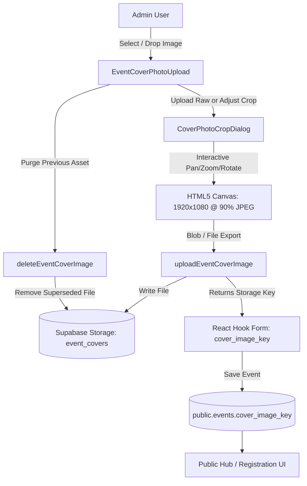

# Event Cover Photos & Storage Lifecycle Architecture

This document describes the design, storage lifecycle, client-side crop mechanics, bucket cleanup policies, and UI rendering rules for Event Cover Photos across the application.

---

## 1. Overview & Architecture

Event cover photos provide high-impact visual branding for events across the Home Hub, Countdown Hero, Public Registration, and Admin Management interfaces.

Instead of storing raw unconstrained images or offloading dynamic crop mathematics to runtime query parameters, the application processes, frames, and optimizes cover images directly in the browser before persisting the resulting 16:9 asset to Supabase Storage.



---

## 2. Storage & File Specifications

### A. Bucket & File Path Structure

- **Storage Bucket**: `event_covers` (Public read access, Admin authenticated upload/delete).
- **File Key Format**: `covers/{slug-or-id}-{timestamp}-{random}.jpg`
- **Helper APIs** (`src/lib/domain/events/api.ts`):
  - `uploadEventCoverImage(file: File, eventIdOrSlug?: string): Promise<string>`
  - `deleteEventCoverImage(coverImageKey: string): Promise<void>`
  - `getEventCoverPublicUrl(coverImageKey: string | null | undefined): string | null`

### B. Upload Constraints & Optimization

| Property                    | Value / Constraint                      | Rationale                                                                            |
| :-------------------------- | :-------------------------------------- | :----------------------------------------------------------------------------------- |
| **Accepted Formats**        | `image/jpeg`, `image/png`, `image/webp` | Standard web formats supported natively by all browsers.                             |
| **Max Upload Size**         | 10 MB raw file input                    | Accommodates high-resolution originals before client-side canvas rasterization.      |
| **Output Standard**         | `1920 x 1080` (16:9 Full HD)            | Uniform aspect ratio prevents layout shifts across cards, headers, and hero banners. |
| **Output Format & Quality** | `image/jpeg` at `0.9` (90%)             | High visual fidelity with lightweight asset payloads (~150 KB – 350 KB).             |

---

## 3. Client-Side Crop & Frame Processing

The `CoverPhotoCropDialog` provides an intuitive, real-time framing canvas for event banners.

### A. Crop Features

- **Interactive Repositioning**: Click & drag or touch-pan across the 16:9 viewport.
- **Continuous Zoom**: Smooth zoom slider ranging from $1.0\times$ up to $4.0\times$.
- **90° Step Rotation**: Rotates the source image in 90-degree increments with auto-bounding recalculations.
- **Framing Presets**:
  - **Fit (Contain)**: Scales image so its entirety is visible with minimal dark letterboxing.
  - **Fill (Cover)**: Computes the exact zoom factor required to fill the entire 16:9 canvas without letterboxing.
- **Safe Zone & Rule-of-Thirds Overlays**:
  - Interactive $3\times3$ compositional grid.
  - Card Content Safe Zone overlay showing where titles, badges, and action buttons sit on collapsed cards.

### B. CORS & Canvas Export Security

When adjusting an existing cover photo loaded from Supabase Storage via an absolute URL (`https://...`):

1. Loading remote images directly into `<canvas>` and calling `toBlob()` triggers browser **CORS tainting** security exceptions.
2. `CoverPhotoCropDialog` intercepts remote image URLs on mount, fetches them with `mode: 'cors'`, and converts them into a local `blob:` URL (`URL.createObjectURL(blob)`).
3. The local blob URL is drawn to `<canvas>`, transformed via `ctx.translate`, `ctx.rotate`, and `ctx.scale`, and cleanly exported via `canvas.toBlob(...)` without security restrictions.

---

## 4. Storage Lifecycle & Asset Cleanup Policy

To avoid orphaned files accumulating in Supabase Storage, superseded or removed cover photos are systematically deleted.

### A. Immediate In-Form Cleanup

- **On New Upload**: When a user replaces an existing cover photo with a new file, the previous key (`previousKey`) is immediately passed to `deleteEventCoverImage(previousKey)`.
- **On Crop Adjustment**: When a user adjusts framing/crop, the newly rendered image is uploaded under a new timestamped key, and the superseded key is immediately purged.
- **On Explicit Removal**: Clicking **Remove** detaches the field value (`onCoverImageKeyChange(null)`) and deletes the asset from the storage bucket.

### B. Form Save Redundancy (`useUpdateEventMutation`)

If an event edit form is submitted with a modified `cover_image_key`, the mutation layer performs a safety check against the previous event state to ensure superseded keys are not retained.

### C. Non-Blocking Fault Tolerance

Storage deletions are wrapped in non-blocking try/catch handlers:

```ts
if (previousKey && previousKey !== uploadedPath) {
  try {
    await deleteEventCoverImage(previousKey);
  } catch {
    // Silently ignore cleanup error so failed storage deletion does not block the user
  }
}
```

If network disruption or bucket permission edge cases prevent immediate deletion, the event save operation and UI flow remain completely uninterrupted.

---

## 5. UI Rendering & Display Architecture

Event cover photos are dynamically displayed across several surfaces, each with specific design and readability rules:

### A. Home Hub Event Cards (`EventCard.tsx`)

| State                          | With Cover Photo                                                                                                                                                                                                                                        | Without Cover Photo (Default)                                                                                                                  |
| :----------------------------- | :------------------------------------------------------------------------------------------------------------------------------------------------------------------------------------------------------------------------------------------------------ | :--------------------------------------------------------------------------------------------------------------------------------------------- |
| **Collapsed (`!detailsOpen`)** | • Full background cover photo with horizontal fade gradient (`from-surface via-surface/90 via-40% to-surface/50`).<br>• **Title is wrapped in a solid white container** (`bg-white rounded-xl border border-border p-3.5 shadow-sm`) for high contrast. | • Clean neutral surface.<br>• Subtle `Calendar` watermark icon (`h-44 w-44 stroke-[0.75] text-primary opacity-[0.04]`) anchored in upper body. |
| **Expanded (`detailsOpen`)**   | • Background overlay is removed.<br>• Title returns to clean unwrapped text styling.<br>• Subtle `Calendar` watermark appears in upper section.<br>• **Full 16:9 aspect-video cover photo** is rendered inside the expanded details accordion body.     | • Exact same subtle `Calendar` watermark remains anchored in place in the upper body (no jumping).                                             |

### B. Home Hub Form Cards (`FormCard.tsx`)

- Form cards mirror default event cards using a subtle `FileText` watermark icon (`h-44 w-44 stroke-[0.75] text-primary opacity-[0.04] -rotate-12`) anchored inside the upper content area for visual consistency.

### C. Public Registration Header (`CollapsibleSectionCard.tsx`, `EventHeaderCard.tsx`)

- Cover background is displayed when collapsed (`!isExpanded`) using `object-center` framing.
- The `Registered: X` attendee count is rendered inside a high-contrast frosted capsule pill (`bg-surface border border-border shadow-sm px-3 py-1 font-semibold text-text` with `font-bold text-primary` count) to guarantee readability over bright or busy cover backgrounds.

### D. Countdown Hero (`CountdownHero.tsx`)

- Renders the cover photo as a full-bleed backdrop with dark gradient overlays (`from-background/95 via-background/80 to-background/60`) ensuring countdown timer digits and action buttons remain legible.
