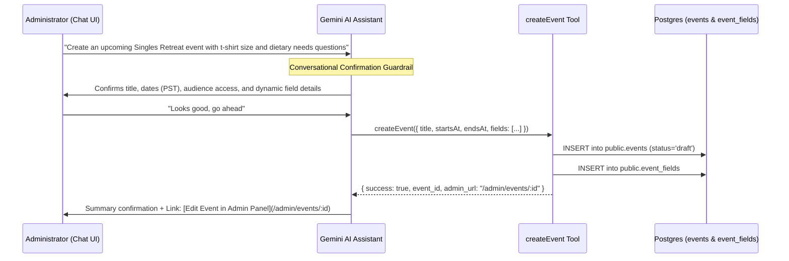

# Event Creation & Lifecycle Architecture

This document describes the design, user workflows, validation rules, mutation layers, dynamic field configuration, and database operations for creating events within the application.

---

## 1. Overview & Pathways

Events in the system can be instantiated through two primary mechanisms:

1. **Direct Manual Creation**: Administrators configure an event shell through the web form at `/admin/events/new`. Following initial creation, administrators configure custom **Dynamic Event Fields** (`/admin/events/:id/fields`) and **Attendance Settings** (`/admin/events/:id/attendance`).
2. **Event Duplication**: Administrators clone an existing event along with its dynamic registration fields, attendance configurations, and check-in questions via the `duplicate-event` edge function and Postgres RPC.

```mermaid
graph TD
    A[Admin User] -->|Manual Entry| B[/admin/events/new]
    A -->|Duplicate Existing| C[Event Actions Menu]

    B --> D[AdminEventFormPage]
    D --> E[useCreateEventMutation]
    E -->|Direct INSERT| F[(public.events)]
    F --> G[Configure Dynamic Fields: /admin/events/:id/fields]
    G --> H[useCreateEventFieldMutation]
    H -->|Direct INSERT| J[(public.event_fields)]

    C --> K[useDuplicateEventMutation]
    K --> L[Edge Function: duplicate-event]
    L --> M[RPC: public.duplicate_event]
    M --> F
    M -->|Atomic Clone Fields| J
    M -->|Atomic Clone Attendance Settings| N[(public.attendance_settings)]
    M -->|Atomic Clone Attendance Fields| O[(public.attendance_fields)]
```

---

## 2. Direct Manual Creation Workflow

### A. Routing & Access Control

- **Route**: `/admin/events/new` (`AdminNewEventPage` -> `AdminEventFormPage` with `mode="create"`).
- **Access Control**: Protected by `RequireAdminAuth`. Unauthenticated sessions or non-admin users are redirected.

### B. Form State & Auto-Slug Generation

- Built with `react-hook-form` and `@hookform/resolvers/zod`.
- Uses `useSlugGeneration` to automate URL slug generation:
  - In `create` mode, typing the **Title** automatically generates a lowercase URL-safe slug (e.g., `"Leadership Summit 2026"` $\rightarrow$ `"leadership-summit-2026"`).
  - Manual edits to the slug field automatically detach the auto-sync listener to preserve custom edits.

### C. Configurable Properties & Form Sections

The form is split into dedicated, reusable subcomponents:

| Section Component                  | Inputs / Fields                                                                                                                     | Description                                                                     |
| :--------------------------------- | :---------------------------------------------------------------------------------------------------------------------------------- | :------------------------------------------------------------------------------ |
| `EventDetailsSection`              | `title`, `slug`, `description`, `location`                                                                                          | Core metadata and identifiers.                                                  |
| `EventDateRangeSection`            | `starts_at`, `ends_at`, `registration_opens_at`, `registration_closes_at`                                                           | Event runtime schedule and registration window.                                 |
| `EventRegistrationSettingsSection` | `status`, `duplicate_policy`, `registration_mode`, `public_registration_access`, `allow_name_lookup`, `send_email_after_completion` | Access policies, duplicate submission handling, and post-registration behavior. |

---

## 3. Schema & Validation (`createEventSchema`)

Validation is enforced through Zod in `src/lib/domain/events/schemas.ts`:

```typescript
export const createEventSchema = z
  .object({
    title: z.string().min(1, 'Title is required').max(200, 'Title must be 200 characters or less'),
    slug: z
      .string()
      .min(1, 'Slug is required')
      .max(100, 'Slug must be 100 characters or less')
      .regex(
        VALIDATION_PATTERNS.eventSlug,
        'Slug must use only lowercase letters, numbers, and hyphens',
      ),
    description: z.string().optional(),
    location: z.string().optional(),
    starts_at: z.string().optional(),
    ends_at: z.string().optional(),
    registration_opens_at: z.string().optional(),
    registration_closes_at: z.string().optional(),
    status: z.enum(['draft', 'published', 'archived']),
    duplicate_policy: z.enum(['block', 'allow_update', 'allow_multiple', 'allow_multiple_update']),
    registration_mode: z.enum(['open', 'closed']),
    public_registration_access: z.enum(['members', 'members_and_public', 'public']),
    allow_name_lookup: z.boolean().optional(),
    send_email_after_completion: z.boolean().optional(),
  })
  .superRefine(applyDateRangeChecks);
```

### Date Validation Constraints

The `applyDateRangeChecks` helper verifies:

1. `ends_at` must be strictly after `starts_at` (if both are specified).
2. `registration_closes_at` must be strictly after `registration_opens_at` (if both are specified).

---

## 4. Timezone & Access Flag Transformation

Before database persistence in `useCreateEventMutation`:

1. **Timezone Normalization**:
   - Dates are converted from local HTML inputs to UTC+8 ISO 8601 strings (`localDateTimeToUTC8ISO`).
2. **Access Control Mapping**:
   - `mapPublicRegistrationAccessToEventFlags` translates `public_registration_access` to internal boolean columns:
     - `'members'`: `allow_public_registrations: false`, `require_id_lookup: true`
     - `'members_and_public'`: `allow_public_registrations: true`, `require_id_lookup: true`
     - `'public'`: `allow_public_registrations: true`, `require_id_lookup: true` (ID-first entry remains supported)
3. **Admin Attribution**:
   - Fetches the active auth user session and queries `public.admins` by `auth_user_id` to populate `created_by_admin_id`.

---

## 5. Persistence Layer (`useCreateEventMutation`)

In accordance with architectural guidelines, the domain hook executes the Supabase query directly without intermediary repositories:

```typescript
const { data, error } = await supabase
  .from('events')
  .insert({
    id: crypto.randomUUID(),
    slug: input.slug,
    title: input.title,
    description: emptyToNull(input.description),
    location: emptyToNull(input.location),
    starts_at: localDateTimeToUTC8ISO(input.starts_at),
    ends_at: localDateTimeToUTC8ISO(input.ends_at),
    registration_opens_at: localDateTimeToUTC8ISO(input.registration_opens_at),
    registration_closes_at: localDateTimeToUTC8ISO(input.registration_closes_at),
    status: input.status,
    duplicate_policy: input.duplicate_policy,
    registration_mode: input.registration_mode,
    allow_public_registrations: publicRegistrationFlags.allow_public_registrations,
    require_id_lookup: publicRegistrationFlags.require_id_lookup,
    metadata: {
      allow_name_lookup: input.allow_name_lookup ?? false,
      public_registration_access: input.public_registration_access,
      send_email_after_completion: input.send_email_after_completion ?? false,
    },
    created_by_admin_id: createdByAdminId,
  })
  .select('id')
  .single();
```

### Cache Management

On mutation success:

- Invalidates `ADMIN_EVENTS_QUERY_KEY` (`['admin', 'events']`).
- Invalidates `QUERY_KEYS.publicEventListing()` (`['events', 'public']`).

---

## 6. Dynamic Event Fields Architecture (`public.event_fields`)

After an event record is created, administrators customize the registration questionnaire with **Dynamic Event Fields**.

### A. Supported Field Types (`EventFieldType`)

The dynamic field system supports 14 field types:

- **Text & Content**: `text`, `textarea`
- **Numeric & Contact**: `number`, `email`, `phone`
- **Choice / Selection**: `select`, `radio`, `checkbox`, `multi_select`, `multi_select_toggle`
- **Temporal**: `date`, `datetime`
- **Specialty**: `boolean`, `color_picker`

### B. Audience Applicability (`EventFieldApplicability`)

Each dynamic field can be conditionally scoped based on the registrant's classification:

- `'members'`: Field is presented exclusively to authenticated/identified church members.
- `'guests'`: Field is presented exclusively to non-member guest registrants.
- `'both'`: Field is presented to all registrants.

### C. Options & Capacity Slot Controls

For selection types (`select`, `radio`, `checkbox`, `multi_select`, `multi_select_toggle`), options are stored as structured JSON arrays (`options: AdminEventFieldOption[]`):

- **General Capacity Limits (`max_slots`)**: Administrators can enforce maximum attendee caps per option value (e.g., workshop choices or breakout sessions).
- **Role-Based Allotments (`max_slots_role_allotments`)**: Sub-capacities can be allocated specifically for member roles (e.g., volunteer categories).

### D. Conditional Field Visibility Rules (`FieldVisibilityRule`)

Fields can depend on responses to previous fields using rules stored in `validation_rules.visibility_rule`:

```json
{
  "visibility_rule": {
    "depends_on_field_key": "dietary_restrictions_toggle",
    "equals_value": "yes"
  }
}
```

During registration, dependent fields remain hidden until their prerequisite conditions are satisfied.

### E. Validation Rules & Field Reordering

- **Field Validation (`validation_rules`)**: Minimum/maximum string lengths, regular expression patterns, numeric bounds, min/max selection counts, date constraints (`min_date`, `max_date`, `allowed_weekdays`), and duplicate resolution keys (`unique_key_component`).
- **Ordering**: Fields maintain a `display_order`. Reordering is performed atomically using the Postgres RPC `public.reorder_event_fields`.

---

## 7. Event Duplication Pathway

When cloning an event:

1. **Frontend Call**: `useDuplicateEventMutation` passes `source_event_id`, `new_title`, and `new_slug` to the `duplicate-event` edge function.
2. **Edge Function & RPC Execution**: The edge function runs the PostgreSQL function `public.duplicate_event`:
   - Checks that `new_slug` does not clash with existing events (`DUPLICATE_SLUG` error code `23505`).
   - Copies event row settings with `status` reset to `'draft'`.
   - Generates new UUIDs and clones:
     - `public.event_fields`: Custom registration form questions, options, validation rules, display orders, and visibility dependencies.
     - `public.attendance_settings`: Timeslot definitions and event-window check-in enforcement.
     - `public.attendance_fields`: Event-day attendance questions and validation.
3. **Result**: A new fully configured draft event is available immediately without manually reconfiguring form schemas.

---

## 8. AI-Assisted Event Creation Pathway (`createEvent` Tool)

Administrators can also create events through natural language conversations with the Welcome Center AI Assistant.



### Key Principles of AI Event Creation:

1. **Strict Two-Phase Confirmation (No Assumptions)**:
   - **Phase 1**: When an admin mentions an event request, the AI synthesizes the proposed configuration (title, dates in PST UTC+8, audience, and custom dynamic fields), asks any necessary clarifying questions, and explicitly asks for confirmation: _"Would you like me to proceed with creating this event as a draft?"_. **The AI does NOT execute the tool in Phase 1.**
   - **Phase 2**: Only when the administrator gives explicit confirmation (e.g., "yes", "proceed", "create it") does the AI invoke `createEvent`.
2. **Duplicate Pre-Creation Awareness**:
   - `createEvent` checks if an active event with the exact title already exists (`status != 'archived'`). If found, it alerts the admin and returns the existing event's admin URL instead of creating a duplicate row (unless `force: true` is passed).
3. **Strict Draft Default**:
   - Every event created via AI defaults to `status: 'draft'`, allowing the administrator to inspect, refine, and safely publish through the UI.
4. **Dynamic Fields Specification**:
   - Custom registration fields (including labels, types, options, required flags, and applicability) are declared and inserted atomically alongside the event.
5. **Mandatory Edit Link**:
   - The assistant always provides a direct Markdown link (`/admin/events/:id`) upon creation so administrators can seamlessly proceed to detailed configuration.

---

## 9. Key File Map

| Purpose                                   | File Path                                                                |
| :---------------------------------------- | :----------------------------------------------------------------------- |
| **New Event Page Entry**                  | `src/pages/admin/events/new/index.tsx`                                   |
| **Unified Form View**                     | `src/pages/admin/events/_event-form/index.tsx`                           |
| **Form Sections**                         | `src/pages/admin/events/_event-form/components/`                         |
| **Event Fields Admin Management**         | `src/pages/admin/events/[id]/fields/`                                    |
| **Zod Validation Schemas (Events)**       | `src/lib/domain/events/schemas.ts`                                       |
| **Domain Types & Helpers (Events)**       | `src/lib/domain/events/types.ts`                                         |
| **Dynamic Fields Domain Types & Schemas** | `src/lib/domain/event-fields/`                                           |
| **Create Event Mutation**                 | `src/hooks/domain/events/mutations/useCreateEventMutation.ts`            |
| **Create Event Field Mutation**           | `src/hooks/domain/event-fields/mutations/useCreateEventFieldMutation.ts` |
| **Duplicate Event Mutation**              | `src/hooks/domain/events/mutations/useDuplicateEventMutation.ts`         |
| **AI Event Creation Chat Tool**           | `supabase/functions/chat/tools/createEvent.ts`                           |
| **Chat Tool Registry**                    | `supabase/functions/chat/tools/index.ts`                                 |
| **Chat Edge Function & System Prompt**    | `supabase/functions/chat/index.ts`                                       |
| **Duplication SQL RPC**                   | `supabase/migrations/20260916100000_add_duplicate_event_rpc.sql`         |
| **Reorder Event Fields SQL RPC**          | `supabase/migrations/20260925093000_add_reorder_event_fields_rpc.sql`    |
