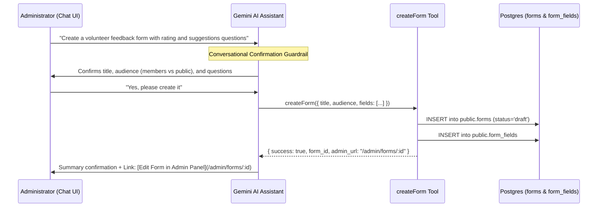

# Form Creation & Lifecycle Architecture

This document describes the design, user workflows, validation rules, mutation layers, dynamic field configurations, and database operations for creating non-event forms within the application.

---

## 1. Overview & Pathways

Forms in the system serve general non-event data gathering (e.g., surveys, feedback questionnaires, ministry sign-ups, volunteer evaluations). Forms can be created through three primary pathways:

1. **Direct Manual Creation**: Administrators configure a form shell through the web form at `/admin/forms/new`. After creating the form, administrators configure dynamic **Form Fields** at `/admin/forms/:id/fields`.
2. **Form Duplication**: Administrators clone an existing form along with all its dynamic fields and validation configurations via the `duplicate-form` edge function and Postgres RPC.
3. **AI-Assisted Form Creation**: Administrators request the Welcome Center AI Assistant to draft a form and its questionnaire fields conversationally via the `createForm` tool.

```mermaid
graph TD
    A[Admin User] -->|Manual Entry| B[/admin/forms/new]
    A -->|Duplicate Existing| C[Form Actions Menu]
    A -->|Natural Language Chat| D[AI Chat Assistant]

    B --> E[FormEditorPage]
    E --> F[useSaveFormMutation]
    F -->|Direct INSERT| G[(public.forms)]
    G --> H[Configure Form Fields: /admin/forms/:id/fields]
    H --> I[useSaveFormFieldMutation]
    I -->|Direct INSERT| J[(public.form_fields)]

    C --> K[useDuplicateFormMutation]
    K --> L[Edge Function: duplicate-form]
    L --> M[RPC: public.duplicate_form]
    M --> G
    M -->|Atomic Clone Fields| J

    D --> N[createForm Tool]
    N --> G
    N -->|Atomic Insert Fields| J
```

---

## 2. Direct Manual Creation Workflow

### A. Routing & Access Control

- **Route**: `/admin/forms/new` (`AdminNewFormPage` -> `FormEditorPage`).
- **Access Control**: Protected by `RequireAdminAuth`. Unauthenticated sessions or non-admin users are redirected to `/`.

### B. Form State & Auto-Slug Generation

- Built with `react-hook-form` and `@hookform/resolvers/zod`.
- Uses `useSlugGeneration` to automate URL slug generation:
  - In create mode, typing the **Title** generates a URL-safe slug (e.g., `"Volunteer Feedback 2026"` $\rightarrow$ `"volunteer-feedback-2026"`).
  - Manual edits to the slug field automatically detach the auto-sync listener to preserve custom edits.

### C. Configurable Properties & Settings

| Property           | Type / Options                                                                   | Description                                             |
| :----------------- | :------------------------------------------------------------------------------- | :------------------------------------------------------ |
| `title`            | `string` (min 1 char)                                                            | Human-readable form title.                              |
| `slug`             | `string` (`^[a-z0-9]+(?:-[a-z0-9]+)*$`)                                          | Unique URL slug identifier.                             |
| `description`      | `string` (optional Markdown)                                                     | Form description displayed at top of submission view.   |
| `status`           | `'draft'` \| `'published'` \| `'archived'`                                       | Form publication lifecycle state. Default is `'draft'`. |
| `audience`         | `'members'` \| `'public'` \| `'members_and_public'`                              | Allowed target audience.                                |
| `duplicate_policy` | `'block'` \| `'allow_update'` \| `'allow_multiple'` \| `'allow_multiple_update'` | Duplicate submission policy per respondent.             |
| `metadata`         | `jsonb` (e.g. `send_email_after_completion`)                                     | Additional form behavioral flags.                       |

---

## 3. Schema & Validation (`adminFormInputSchema`)

Validation is enforced in `src/lib/domain/forms/schemas.ts`:

```typescript
export const adminFormInputSchema = z.object({
  slug: z
    .string()
    .trim()
    .min(1, 'Slug is required')
    .regex(/^[a-z0-9]+(?:-[a-z0-9]+)*$/, 'Slug must be lowercase alphanumeric with hyphens'),
  title: z.string().trim().min(1, 'Title is required'),
  description: z.string().trim().nullable().optional(),
  status: z.enum(['draft', 'published', 'archived']),
  duplicate_policy: z.enum(['block', 'allow_update', 'allow_multiple', 'allow_multiple_update']),
  audience: z.enum(['members', 'public', 'members_and_public']),
  metadata: z.record(z.string(), z.unknown()).optional(),
});
```

---

## 4. Dynamic Form Fields Architecture (`public.form_fields`)

After an initial form shell is created, administrators customize the questionnaire with **Form Fields**.

### A. Supported Field Types (`EventFieldType`)

The forms subsystem supports all 13 standard field types:

- **Text & Longform**: `text`, `textarea`
- **Numeric & Contact**: `number`, `email`, `phone`
- **Choice / Selection**: `select`, `radio`, `checkbox`, `multi_select`
- **Temporal**: `date`, `datetime`
- **Specialty**: `boolean`, `color_picker`

### B. Audience Applicability (`FormFieldApplicability`)

Each form field can be targeted to specific audience segments:

- `'all'`: Field is presented to both church members and public respondents.
- `'member_only'`: Field is rendered exclusively when a signed-in member completes the form.
- `'public_only'`: Field is rendered exclusively when an anonymous / public respondent completes the form.

### C. Options & Validation Rules

- **Options (`options`)**: For choice types (`select`, `radio`, `checkbox`, `multi_select`), options are stored as structured JSON arrays: `[{ label: string, value: string }]`.
- **Validation Rules (`validation_rules`)**: Minimum/maximum string lengths, regular expression patterns, numeric bounds, date boundaries, and conditional visibility rules.
- **Conditional Visibility (`visibility_rule`)**: Fields can dynamically display depending on previous answers (`depends_on_field_key`, `equals_value`).

### D. Field Display Ordering

- Fields maintain a sequential `display_order`.
- Reordering is performed atomically via the PostgreSQL RPC `public.reorder_form_fields(p_form_id, p_field_ids)`.

---

## 5. Persistence Layer (`useFormMutations.ts`)

Direct database operations in TanStack React Query hooks:

```typescript
// Create base form
const { data: form, error } = await supabase
  .from('forms')
  .insert(data)
  .select()
  .single();

// Create form field
const { data: field, error } = await supabase
  .from('form_fields')
  .insert({ ...fieldData, form_id: formId })
  .select()
  .single();
```

### Cache Management

On mutation success:

- Invalidates `ADMIN_FORMS_QUERY_KEY` (`['admin', 'forms']`).
- Invalidates `adminFormQueryKey(form.id)`.
- Invalidates `formFieldsQueryKey(form.id, ...)`.

---

## 6. Form Duplication Pathway

When cloning an existing form:

1. **Frontend Call**: `useDuplicateFormMutation` passes `source_form_id`, `new_title`, and `new_slug` to the `duplicate-form` edge function.
2. **Postgres RPC (`public.duplicate_form`)**:
   - Verifies slug uniqueness.
   - Deep-clones the form record with `status` reset to `'draft'`.
   - Deep-clones all linked records in `public.form_fields` (preserving options, validation rules, field applicability, and display order).
3. **Result**: A new complete draft form is immediately ready for editing.

---

## 7. AI-Assisted Form Creation Pathway (`createForm` Tool)

Administrators can create forms directly via natural language in the admin chat assistant.



### AI Form Creation Protocols:

1. **Strict Two-Phase Confirmation (No Assumptions)**:
   - **Phase 1**: When an admin mentions a form request, the AI synthesizes the proposed configuration (title, audience, duplicate policy, and specific questions/fields), asks any necessary clarifying questions, and explicitly asks: _"Would you like me to proceed with creating this form as a draft?"_. **The AI does NOT execute the tool in Phase 1.**
   - **Phase 2**: Only when the administrator gives explicit confirmation (e.g., "yes", "proceed", "create it") does the AI invoke `createForm`.
2. **Duplicate Pre-Creation Awareness**:
   - `createForm` checks if an active form with the exact title already exists (`status != 'archived'`). If found, it alerts the admin and returns the existing form's admin URL instead of creating a duplicate row (unless `force: true` is passed).
3. **Strict Draft Default**:
   - All forms created via AI default strictly to `status: 'draft'` to ensure administrators can review before publishing.
4. **Dynamic Fields Creation**:
   - Form questions are declared in the `fields` array and inserted atomically into `public.form_fields`.
5. **Mandatory Output Link**:
   - The assistant always provides the direct link: `[Edit Form in Admin Panel](/admin/forms/<form_id>)`.

---

## 8. Key File Map

| Purpose                         | File Path                                                            |
| :------------------------------ | :------------------------------------------------------------------- |
| **New Form Page Entry**         | `src/pages/admin/forms/new/index.tsx`                                |
| **Form Editor Page**            | `src/pages/admin/forms/_form-editor/index.tsx`                       |
| **Form Fields Builder**         | `src/pages/admin/forms/[id]/fields/`                                 |
| **Form Domain Schemas**         | `src/lib/domain/forms/schemas.ts`                                    |
| **Form Domain Types**           | `src/lib/domain/forms/types.ts`                                      |
| **Form Domain Mutations**       | `src/hooks/domain/forms/mutations/useFormMutations.ts`               |
| **Duplicate Form Mutation**     | `src/hooks/domain/forms/mutations/useDuplicateFormMutation.ts`       |
| **AI Form Creation Chat Tool**  | `supabase/functions/chat/tools/createForm.ts`                        |
| **Chat Tool Registry**          | `supabase/functions/chat/tools/index.ts`                             |
| **Duplication SQL RPC**         | `supabase/migrations/20260919300000_add_duplicate_form_rpc.sql`      |
| **Reorder Form Fields SQL RPC** | `supabase/migrations/20260924164522_add_reorder_form_fields_rpc.sql` |
